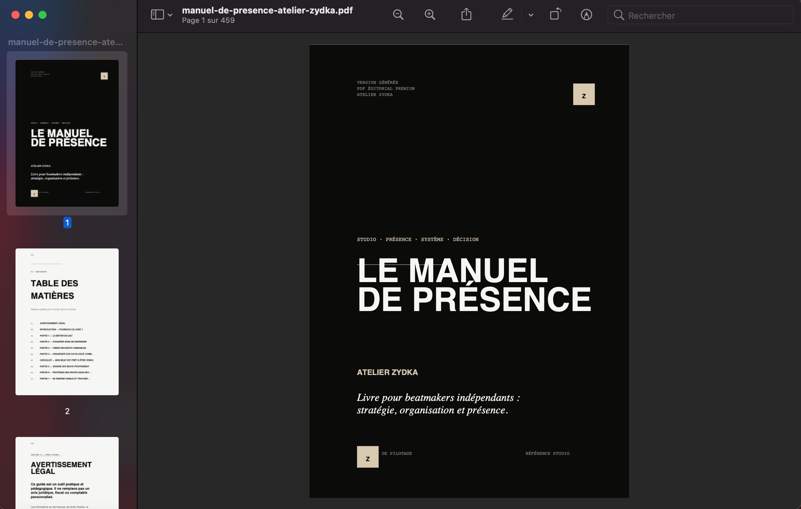
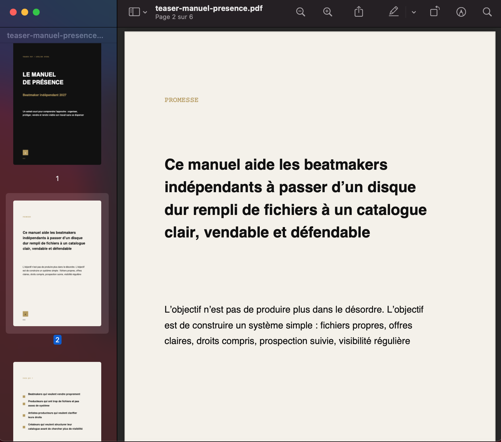
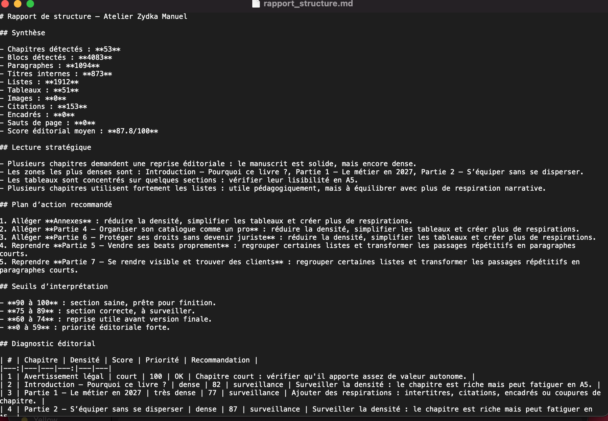
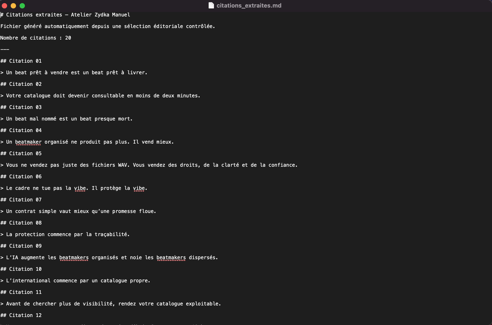
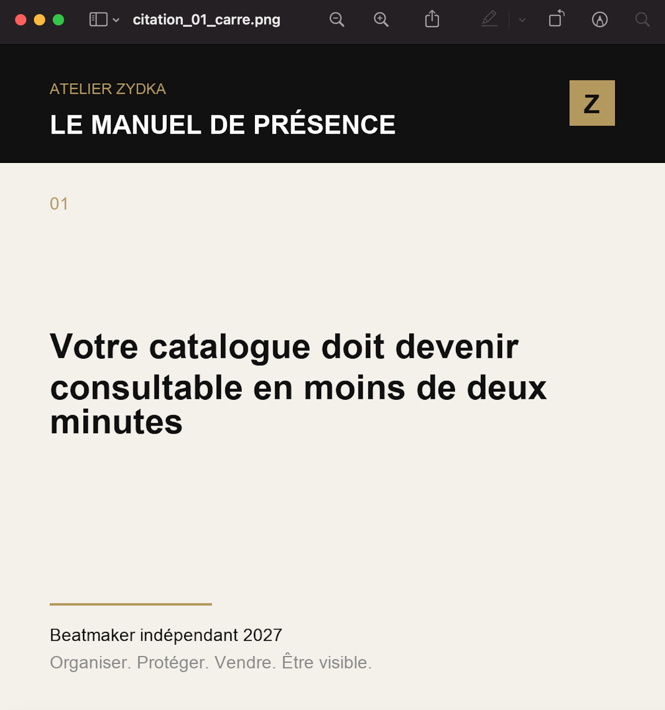
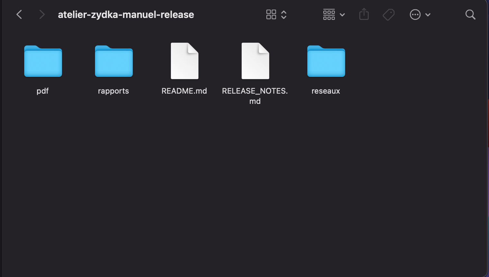
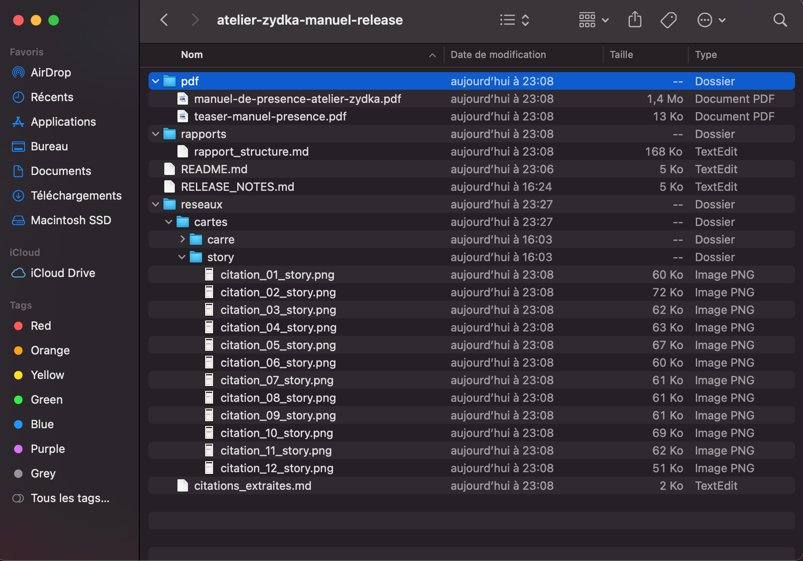
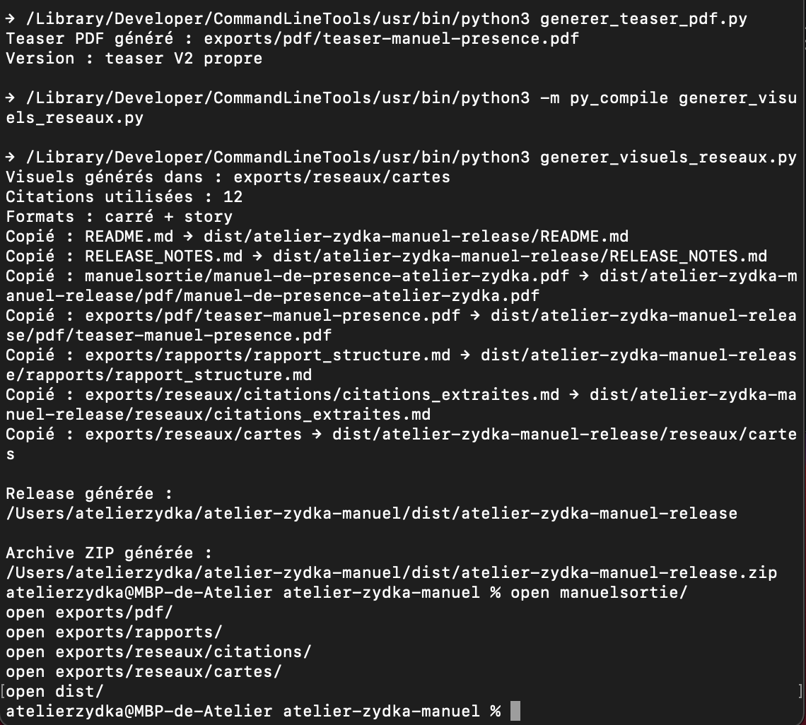

# Atelier Zydka Manuel

Atelier Zydka Manuel est un système éditorial local qui transforme un manuscrit source en pack éditorial complet.

Il permet de générer :

- un PDF principal
- un teaser PDF
- un rapport éditorial
- des citations marketing
- des visuels réseaux sociaux
- un dossier de release
- une archive ZIP transmissible

Version actuelle : V2.1 — Packaging éditorial propre.

## Vision produit

Transformer une matière brute en produit éditorial complet, personnalisable et diffusable.

Promesse commerciale :

Transformez votre manuscrit en livre PDF premium, teaser, citations marketing, visuels réseaux sociaux et dossier de publication prêt à diffuser.

## État actuel

Le projet dispose actuellement de :

- pipeline complet
- génération PDF
- génération teaser
- génération rapport éditorial
- génération citations marketing
- génération visuels réseaux sociaux
- dossier de release
- archive ZIP
- manuscrit V13 intégré
- citations marketing contrôlées
- commande make release
- commande make archive
- guide utilisateur

## Structure principale

- make.py
- config.json
- manuscrit_beatmakers.txt
- parser_manuscrit.py
- verifier_manuscrit.py
- generer_livre_manuel_presence.py
- rapport_structure.py
- generer_exports_marketing.py
- generer_teaser_pdf.py
- generer_visuels_reseaux.py
- manuelsortie/
- exports/
- dist/
- images/
- docs/
- README.md
- RELEASE_NOTES.md

## Commandes principales

Vérifier le manuscrit :

    python3 make.py check

Générer le PDF principal :

    python3 make.py pdf

Générer le rapport éditorial :

    python3 make.py structure

Générer les citations marketing :

    python3 make.py marketing

Générer le teaser PDF :

    python3 make.py teaser

Générer les visuels réseaux sociaux :

    python3 make.py visuals

Générer tout le pipeline :

    python3 make.py all

Générer le dossier de release :

    python3 make.py release

Générer l’archive ZIP :

    python3 make.py archive

## Workflow recommandé

Pour générer une version complète propre :

    python3 make.py archive

Le livrable final est généré ici :

    dist/atelier-zydka-manuel-release.zip

## Livrables générés

Le projet peut produire :

- manuelsortie/manuel-de-presence-atelier-zydka.pdf
- exports/pdf/teaser-manuel-presence.pdf
- exports/rapports/rapport_structure.md
- exports/reseaux/citations/citations_extraites.md
- exports/reseaux/cartes/
- dist/atelier-zydka-manuel-release/
- dist/atelier-zydka-manuel-release.zip

## Manuscrit source

Le manuscrit principal est :

    manuscrit_beatmakers.txt

Version actuellement intégrée :

    BEATMAKER INDÉPENDANT 2027 — ÉDITION V13 Ultime

## Documentation

Le guide utilisateur est disponible ici :

    docs/GUIDE_UTILISATEUR.md

Il explique :

- le fonctionnement du projet
- les commandes principales
- les dossiers de sortie
- la génération du ZIP
- les erreurs fréquentes
- les bonnes pratiques Git
- les limites connues de la V2.1

## Citations marketing

Depuis la V2.1, les citations marketing sont générées à partir d’une sélection éditoriale contrôlée.

Objectif :

- éviter les extractions parasites
- éviter les titres d’annexes
- éviter les fragments Markdown
- produire des visuels réseaux exploitables

## Roadmap

### V2.1 — Packaging éditorial propre

Objectif :

- livrer proprement
- expliquer
- montrer
- rendre le projet testable
- préparer la vente

### V2.2 — Parser intelligent et contrôle éditorial

Objectif :

- nettoyer le Markdown
- détecter les vrais chapitres
- exclure les pages démo
- corriger la grille A5
- détecter les pages trop longues
- générer un rapport qualité éditorial
- gérer les statuts de chapitre
- masquer les notes internes à l’export

### V2.3 — Personnalisation minimale

Objectif :

- enrichir config.json
- personnaliser le titre, l’auteur, les couleurs, le logo et les formats
- rendre le projet adaptable sans modifier directement le code Python

### V2.5 — Interface locale

Objectif :

- créer une interface locale avec Streamlit
- piloter le moteur sans terminal
- personnaliser le projet
- générer les exports
- télécharger le ZIP

### V3 — Studio éditorial premium

Objectif :

- bibliothèque de projets
- templates
- prévisualisation avancée
- export HTML, EPUB, DOCX, PDF print
- mode client
- système éditorial complet

## Prochaine priorité

Priorités immédiates V2.1 :

1. ajouter des captures dans docs/screenshots/
2. améliorer les premières pages PDF
3. enrichir config.json
4. préparer une page de vente
5. organiser un bêta-test

## Licence

Ce projet est en cours de structuration.

Une licence d’utilisation dédiée devra être ajoutée avant diffusion commerciale publique.

---

## Aperçu visuel

Quelques captures permettent de visualiser les principaux livrables générés par Atelier Zydka Manuel.

### PDF principal

### Teaser PDF

### Rapport éditorial

### Citations marketing

### Visuels réseaux sociaux

### Dossier de release

### Archive ZIP

### Terminal — génération archive

---

## Personnalisation via config.json

Depuis la V2.2, plusieurs éléments du projet peuvent être personnalisés depuis :

    config.json

Champs principaux :

- project_title
- book_title
- book_subtitle
- author_name
- brand_name
- baseline
- year
- output_pdf_name
- teaser_pdf_name
- release_name
- zip_name
- theme.background
- theme.text
- theme.accent
- theme.muted

Exemple :

    {
      "book_title": "Mon guide",
      "author_name": "Nom de l’auteur",
      "brand_name": "Ma marque",
      "baseline": "Créer · publier · diffuser",
      "release_name": "mon-guide-release",
      "zip_name": "mon-guide-release.zip"
    }

Cette évolution permet d’adapter le moteur à un autre projet sans modifier directement les scripts Python.

---

## V2.3 — PDF principal configurable

Depuis la V2.3, le PDF principal utilise davantage les valeurs définies dans `config.json`.

Éléments désormais connectés :

- titre du livre ;
- sous-titre ;
- auteur ;
- marque ;
- baseline ;
- année ;
- couleurs principales du thème ;
- nom du fichier PDF.

Champs utilisés :

    book_title
    book_subtitle
    author_name
    brand_name
    baseline
    year
    output_pdf_name
    theme.background
    theme.text
    theme.accent
    theme.muted

Cette évolution rend le PDF principal plus cohérent avec la promesse de personnalisation du moteur éditorial.

---

## V3.0 — Interface locale Streamlit

Depuis la V3.0, Atelier Zydka Manuel dispose d’une interface locale expérimentale basée sur Streamlit.

Elle permet de piloter le moteur sans utiliser directement le Terminal pour chaque action.

Fonctions disponibles :

- visualiser l’état du projet ;
- modifier `config.json` ;
- modifier ou importer un manuscrit `.txt` ou `.md` ;
- lancer la génération de l’archive ZIP ;
- consulter les logs ;
- télécharger le ZIP généré ;
- afficher le rapport éditorial ;
- afficher les citations marketing ;
- retrouver les dossiers de sortie.

### Lancer l’interface

Commande :

    python3 -m streamlit run app_streamlit.py

L’application s’ouvre ensuite dans le navigateur à l’adresse :

    http://localhost:8501

### Note importante

L’interface est locale. Elle ne publie rien en ligne.

Les vrais livres ou contenus commerciaux doivent rester dans un dossier privé non versionné :

    private/

Le dépôt public doit continuer à contenir uniquement un manuscrit de démonstration.

---

## V3.1 — Lancement simplifié de l’application

Depuis la V3.1, Atelier Zydka Manuel contient des fichiers de lancement pour faciliter l’ouverture de l’interface locale.

### Installer les dépendances

Commande recommandée :

    python3 -m pip install -r requirements.txt

### Lancer l’application avec le Terminal

Commande directe :

    python3 -m streamlit run app_streamlit.py

### Lancer avec le script shell

Sur Mac ou Linux :

    ./launch_app.sh

### Lancer avec le fichier macOS

Sur Mac, il est possible de double-cliquer sur :

    launch_app.command

Si macOS bloque l’ouverture pour des raisons de sécurité, utilisez plutôt la commande Terminal :

    ./launch_app.sh

### Fichiers ajoutés

- requirements.txt
- launch_app.sh
- launch_app.command

Cette évolution réduit la friction de lancement pour les utilisateurs non techniques.

---

## V3.1 — Lancement simplifié de l’application

Depuis la V3.1, Atelier Zydka Manuel contient des fichiers de lancement pour faciliter l’ouverture de l’interface locale.

### Installer les dépendances

Commande recommandée :

    python3 -m pip install -r requirements.txt

### Lancer l’application avec le Terminal

Commande directe :

    python3 -m streamlit run app_streamlit.py

### Lancer avec le script shell

Sur Mac ou Linux :

    ./launch_app.sh

### Lancer avec le fichier macOS

Sur Mac, il est possible de double-cliquer sur :

    launch_app.command

Si macOS bloque l’ouverture pour des raisons de sécurité, utilisez plutôt la commande Terminal :

    ./launch_app.sh

### Fichiers ajoutés

- requirements.txt
- launch_app.sh
- launch_app.command
- app_streamlit.py

Cette évolution réduit la friction de lancement pour les utilisateurs non techniques.

---

## V3.2 — Mode projets privés

Depuis la V3.2, Atelier Zydka Manuel permet de travailler avec des projets privés stockés localement.

Objectif :

    utiliser de vrais manuscrits commerciaux sans les publier dans le dépôt GitHub.

Structure utilisée :

    private/
    └── projets/
        └── nom-du-projet/
            ├── config.json
            └── manuscrit.txt

L’interface Streamlit permet désormais de :

- créer un projet privé ;
- charger un projet privé ;
- sauvegarder la configuration dans un projet privé ;
- sauvegarder le manuscrit dans un projet privé ;
- générer le pack éditorial depuis un projet chargé ;
- conserver le dépôt public avec un simple manuscrit de démonstration.

### Important

Le dossier `private/` ne doit pas être versionné.

Les vrais livres, guides, formations ou contenus commerciaux doivent rester dans :

    private/projets/
